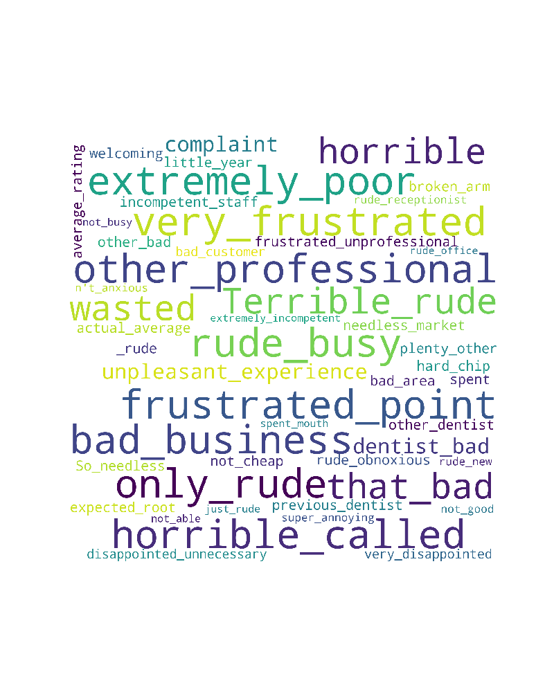
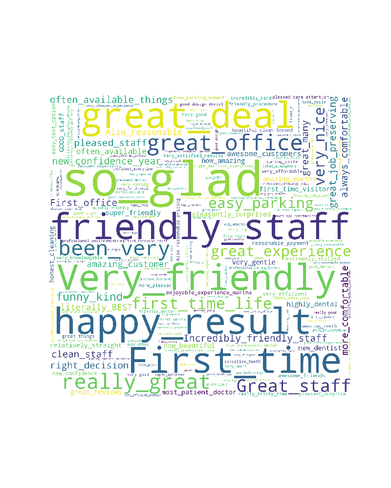

# Table of Contents
1. [Problem](README.md#problem)
1. [Input Dataset](README.md#input-dataset)
1. [Output](README.md#output)
1. [Approach](README.md#Approach)
1. [Testing](README.md#Testing)
1. [Logging](README.md#Logging)
1. [Run_Instructions](README.md#Run_Instructions)
1. [Questions?](README.md#questions?).

## Problem
During my Internship I worked with a digital health platform company that helps practices attract and retain their 
patients. They had a review request survey form that was used to help practices understand patient feedback – in order
to boost patient retention, and allows practices to generate reviews – which attracts more patients. Due to this, 
they had a big pool of patient feedbacks including public reviews given on Facebook and Google, which they wanted to
utilize to perform data mining to identify some of the issues a given practice has (or things they're doing well).

## Goals

● To display two Word Clouds (one for positive, one for negative) for all the practices who have more certain amount of 
reviews in order to get a high level feel how the practice is doing.
● To further identify the issues that a given practice has, or the strongpoints they have, we want to list top 3 items 
in each category. This goal will be a derivative of the first goal. 

## Input Data
Data consisted of ~1 Million reviews and had information about patient, their appointment details and features such as
id, rating, location_id, description, review_date.

## Data Pipeline

I had to first load the data into Pandas dataframe from csv file. After loading the data, I performed text cleaning on 
the reviews. Initially I removed stop words from reviews and made reviews lowercase, removed doctor names. After that, 
I performed dependency parsing and part of speech tagging on each review. Collected all nouns used in the reviews as 
candidate unigram aspects. Filtered out unigrams that are unlikely to be aspects.Performed association rule mining to
find candidate bigram and trigram aspects. Used set of words obtained from Step 3 and compactness pruning to filter out
bigrams that are unlikely to be aspects. Connected set of bigram words that appear frequently together in same sentences
into trigrams.Performed sentiment analysis of reviews and classified them in one of the following categories: [positive 
sentiment, negative sentiment, or mixed sentiment] using user given ratings and NLP Libraries - TextBlob, Afinn. 
Generated top 8 topics based on results for the top 8 frequent aspects.After the aspects have been generated checked if
the aspect belongs to aspect_class, if yes then assign the class name to aspect. Also filtered if a name appeared in 
the aspects. As a final outcome, for each location_id a json file was generated named as location_id.json

## Results 
For each practice json file was generated in the following format:

## Conclusion
Word clouds(one for positive, one for negative) for all the practices helped to get a high-level feel of how the 
practice is doing. 
Aspect-based sentiment analysis, helped a medical practice to identify top-N aspects/topics from all the reviews given 
by their patients. I identified the top 8 topics for each practice and classified the reviews in 3 different categories 
(positive, negative and mixed). This project helped to improve patient satisfaction by identifying and resolving topics 
for which patients have negative sentiments leading to increased patient retention.
 

d

