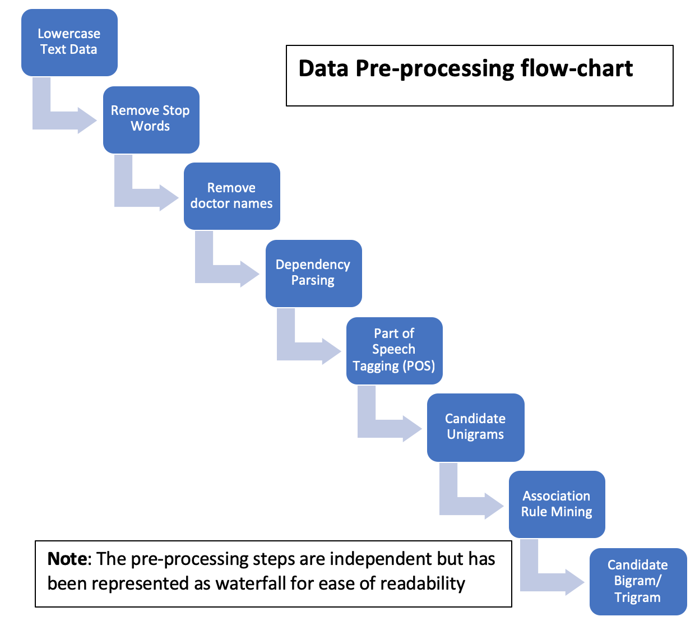
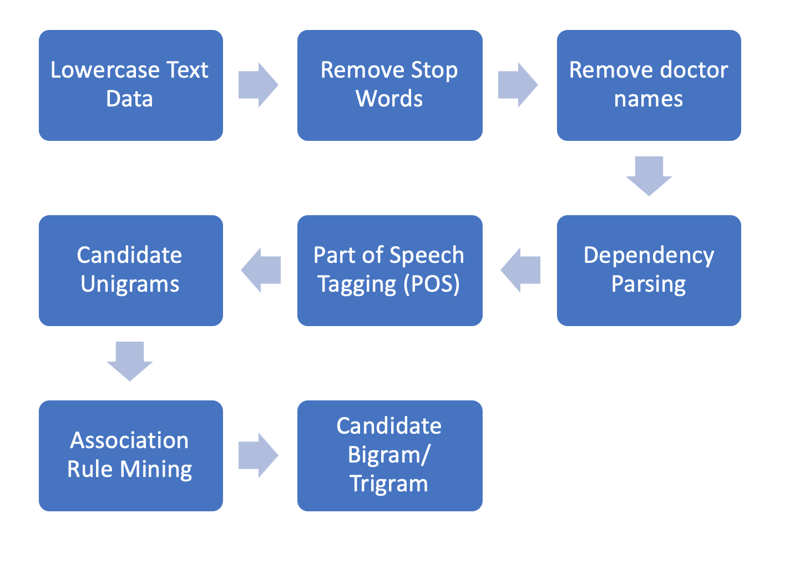
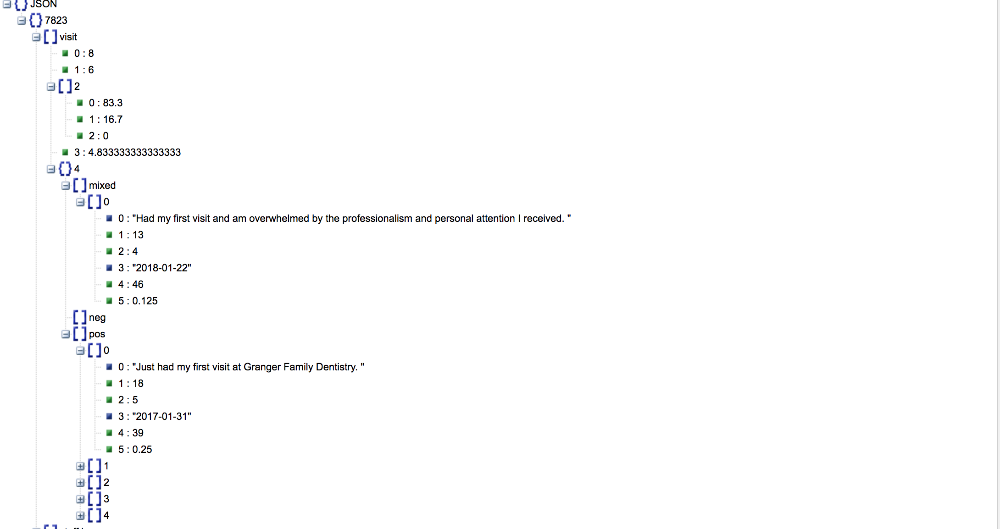
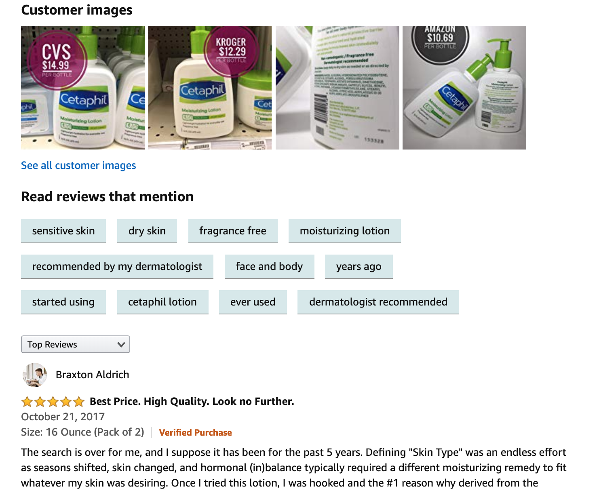

# Table of Contents
1. [Problem](README.md#problem)
1. [Goals](README.md#Goals)
1. [Input Data](README.md#Input_Data)
1. [Data Pipeline](README.md#Data Pipeline)
1. [Results](README.md#Results)
1. [Conclusion](README.md#Conclusion)

## Problem
During my Internship I worked with a digital health platform company that helps practices attract and retain their 
patients. They helped the practices to understand their patient feedback – in order to boost patient retention, and allows practices to generate reviews – which attracts more patients. The company had a text corpus of patients' feedback including public reviews given on Facebook and Google. They wanted to utilize it to perform data mining to automatically identify the topics patient care about most and also identify if these topic hasd a positive or negative impact on the customers.

## Goals
1. To identify the phrases/words in the customer reviews that help to understand the sentiments of the customer and then display these words as `words clouds`, for both positive and negative sentiments. The deliverable was to generate an image that would be shown to practices giving them a `high level overview of sentiments` of customers toward their practice.

2. Identify the top `aspects/topics` about a given practice, or in other words `top characteristics` they have. We want want to list top N-topics that practitioner should know about their practice.
>For Example, Practice X might have positive reviews about `cost` and `good staff` but have bad reputation in terms od `satisfaction` or `scheduling`. 

## Input Data
Input data consisted of nearly 1 Million patient reviews regarding their visit to a practice. Data had following features such as `id, rating, practice_id, feedback, review_date`.

## Data Pipeline

The data pipeline comprised of following stages - 
1. Data ingestion
2. Data Cleaning
3. Modelling
4. Evaluation

### 1. Data Ingestion
Originally, data was stored in relational database(PostgreSQL), so the first step was to fetch the data. Once extracted, I aggregated the data by practice and stored the aggregated data in `.csv` file on AWS S3. Following this I loaded the .csv file into Pandas dataframe. 

### 2. Data Cleaning and Pre-processing
This was the one of the most important parts of the project. As I was dealing with text data I had to pre-process to perform text cleaning which could be used in later stages. Following diagram represents the steps in pre-processing - 

Most of the preprocessing was performed using `NLTK and SpaCy` python packages. Initially I converted data `to lowercase`, in next step I removed `characters and numbers` using RegEx, then I removed `stop words` and all the `proper nouns` eg. Doctor Name, Clinic Name, City etc. Following this I generated POS Tags, Association between words, and identified candidate unigrams. Most of the heavy lifting was done in this step.

### 3. Modelling
Modelling was the hardest part of this project not because it was a text data, but there were no existing open projects that would analyze patients' reviews. Most of the projects on aspect identification deal with restaurant reviews or amazon reviews so there were no existing `Linguistic Association Rules` or `pre-trained DL models`. This meant I would have to write my custom rules in `NLTK` and also filter out candidate aspects based on my data itself. The modeling had following stages - 
1. To generate `word-clouds` I was looking into following relationships - `noun-adjective, pronoun-adjective, verb-adverb` between POS in the text review, this allowed me to come up with phrases or individual qualities. For example - `doctor is good, horrible staff`
 
2. To identify aspects for a practice, I identified nouns (except proper noun) that had `noun-adjective, noun-adverb` relationship to other words and then used these nouns are the candidates for topics. Following this I filter out unigrams that are unlikely to be aspects. Used set of words obtained from unigram filtering and used compactness pruning to filter out bigrams that are unlikely to be aspects. Group connected set of bigram words that appear frequently together in same sentences into trigrams.

3. Even though patients had provided their review ratings, I Performed sentiment analysis of reviews as the ratings were based on the overall visit experience and not a particular aspect of visit. So, I peformed sentiment analysis of the reviews and classified sentiments in one of the following categories: `positive sentiment, negative sentiment, or mixed`. I wrote custom rules for classifying the reviews into these 3 categories using NLP Libraries - `TextBlob, Afinn`. 

### 4. Evaluation
After the aspect terms were generated I manually reviewed some aspects to check if they are actually adhering to business logic. I soon figured out that there were synonyms and pseudonyms being used for same attributes. 
> For example, Clinic was being referred to as `hospital, office, shop` etc. 

So, I created `common categories` map to which these words would belong to. If the aspect appeared in this class, then I would assign the class name to aspect. I also created a `non-aspects` list which would filter out any aspects appearing in this list.

## Results 
For each practice, following results were being generated - 

**Word Clouds:** for Positive and Negative words/phrases as shown below.
 
 
 
**Aspects Words:** A json file that would have aspect words and corresponding reviews categorized into three sentiment buckets.

This json wasn't directly provided to customers but instead interpreted and displayed on frontend to look like an example below from Amazon reviews for reference.

## Conclusion
Word clouds(one for positive, one for negative) for all the practices helped to get a high-level feel of how the 
practice is doing. 
Aspect-based sentiment analysis, helped a medical practice to identify top-N aspects/topics from all the reviews given 
by their patients. I identified the top 8 topics for each practice and classified the reviews in 3 different categories 
(positive, negative and mixed). This project helped to improve patient satisfaction by identifying and resolving topics 
for which patients have negative sentiments leading to increased patient retention.

